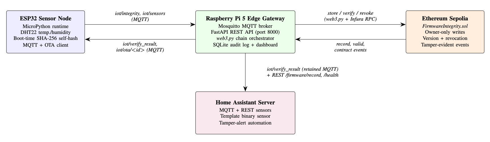
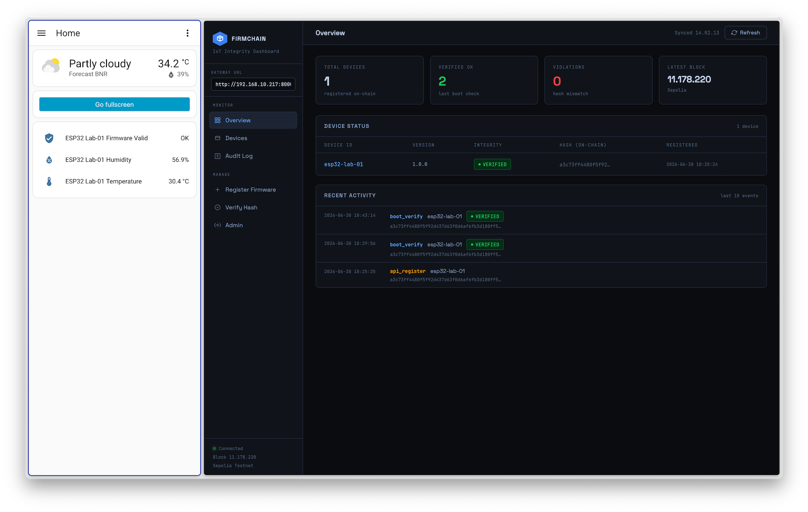

# TGW FirmChain

Blockchain-enabled firmware integrity verification for IoT infrastructure,
extending the [MostaqHossain/firmware-blockchain](https://github.com/MostaqHossain/firmware-blockchain)
proof-of-concept into a real deployment.

**Stack:** ESP32 (MicroPython) + DHT22 → Mosquitto MQTT → Raspberry Pi 5 gateway
(FastAPI + web3.py) → Ethereum Sepolia testnet → Home Assistant.

---

## Architecture



---

## Project Structure

```
firmware-blockchain-iot/
├── contracts/
│   └── FirmwareIntegrity.sol       # Solidity contract with onlyOwner access control,
│                                   # version tracking, revocation, and verifyFirmware()
├── esp32_firmware/
│   └── main.py                     # MicroPython: DHT22 + SHA-256 self-hash + MQTT + OTA
├── gateway/
│   ├── gateway.py                  # FastAPI + MQTT + web3.py orchestrator
│   ├── dashboard.html              # Web UI served at http://<pi>:8000/
│   └── requirements.txt
├── ha_integration/
│   ├── firmware_integrity.yaml     # HA package file (recommended — drop in /config/packages/)
│   └── configuration.yaml          # Reference snippets if not using packages
└── scripts/
    ├── deploy_contract.py          # Compile + deploy via Foundry/forge (ARM64-nae)
    ├── register_firmware.py        # Hash firmware file → POST to gateway API
    ├── flash_esp32.sh              # esptool erase+flash + mpremote upload
    └── setup_gateway.sh            # Full Pi setup: Mosquitto, venv, systemd, Foundry (system-wide)
```

---

## Deployment

### Testbed Components

| Component | Version |
|-----------|-------------|
| Raspberry Pi OS | 6.12, 64-bit |
| Python | 3.13.5 |
| MicroPython for ESP32 | 1.18 |

---

### Step 1 — Raspberry Pi: run setup

```bash
git clone https://github.com/adinugroho52/firmware-blockchain-iot
cd firmware-blockchain-iot
sudo bash scripts/setup_gateway.sh
```

Edit the generated env file — fill in `INFURA_URL` and `PRIVATE_KEY`:

```bash
sudo nano /opt/firmware-gateway/.env
```

`setup_gateway.sh` also installs Foundry (`forge`) to `/usr/local/share/foundry`
and symlinks it into `/usr/local/bin`, so `forge` is on `PATH` for every user.

---

### Step 2 — Deploy the smart contract

`deploy_contract.py` compiles and deploys via Foundry's `forge`. As a sanity check,
if `forge` isn't found on `PATH`, the script prints install instructions and exits.

```bash
cd /opt/firmware-gateway
source venv/bin/activate
python deploy_contract.py
```

Copy the printed `CONTRACT_ADDRESS` into `.env`, then restart the gateway:

```bash
sudo systemctl restart firmware-gateway
```

---

### Step 3 — Flash the ESP32

```bash
pip install esptool mpremote

# Download MicroPython binary: https://micropython.org/download/ESP32_GENERIC/
# Here is an example to flash v1.18 (available in this repo)
bash scripts/flash_esp32.sh /dev/ttyUSB0 ESP32_GENERIC-D2WD-20220117-v1.18.bin
```

Configure `esp32_firmware/main.py`:

```python
WIFI_SSID     = "your_ssid"
WIFI_PASSWORD = "your_password"
MQTT_BROKER   = "your_gateway_ip"
DEVICE_ID     = "esp32-lab-01"     # Adjust as needed
FIRMWARE_FILE = "/main.py"         # MicroPython VFS root
```

Re-upload after editing:

```bash
mpremote connect /dev/ttyUSB0 fs cp esp32_firmware/main.py :/main.py
mpremote connect /dev/ttyUSB0 reset
```

Verify the hash is being computed correctly from the serial monitor (e.g. `screen`). You should see:

```
[HASH] VFS root contents: ['main.py', ...]
[HASH] Read XXXX bytes from /main.py
[BOOT] Firmware SHA-256: <64-char hex>
```

---

### Step 4 — Register firmware hash on-chain

```bash
# Adjust args as needed
python scripts/register_firmware.py \
  --firmware esp32_firmware/main.py \
  --device-id esp32-lab-01 \
  --version 1.0.0 \
  --gateway 192.168.1.1
```

---

### Step 5 — Start the gateway

```bash
sudo systemctl start firmware-gateway
sudo journalctl -u firmware-gateway -f
```

The web dashboard is available at `http://your_gateway_ip:8000/`.

---

### Step 6 — Home Assistant integration

```bash
mkdir -p /config/packages
cp ha_integration/firmware_integrity.yaml /config/packages/
```

Add to `/config/configuration.yaml` (merge under existing `homeassistant:` key if present):

```yaml
homeassistant:
  packages: !include_dir_named packages
```

Go to **Developer Tools → Check Configuration**, then restart HA.

---

## Screenshot



---

## Runtime Integrity Flow

```
ESP32 boots
  └─► SHA-256(/main.py) computed in 512-byte chunks
  └─► publish {device_id, event:"boot", firmware_hash} → iot/integrity (retain=False)

Gateway receives
  └─► verifyFirmware(device_id, hash) — read-only call, no gas cost
  └─► publish {device_id, valid, fw_hash, ts} → iot/verify_result (retain=True)
  └─► write to SQLite audit log

Home Assistant
  └─► MQTT sensor replays retained message immediately on HA restart
  └─► binary_sensor.esp32_lab01_integrity_ok flips on state change
  └─► automation fires persistent notification on TAMPERED
```

---

## Gateway REST API

| Method | Endpoint | Description |
|--------|----------|-------------|
| GET | `/` | Web dashboard |
| GET | `/health` | Gateway + chain connectivity |
| POST | `/firmware/register` | Store hash on-chain |
| GET | `/firmware/verify` | Verify hash against chain |
| GET | `/firmware/record` | Get full on-chain record |
| POST | `/firmware/revoke` | Revoke device record |
| GET | `/audit` | SQLite audit log |
| GET | `/admin/pending-nonce` | Diagnose stuck transactions |
| POST | `/admin/cancel-pending` | Flush stuck mempool transactions |

---

## Security Notes

- `PRIVATE_KEY` in `.env` is `chmod 600` and owned by the service user
- The Solidity contract enforces `onlyOwner` on all write functions
- For production: enable Mosquitto TLS + password auth (`allow_anonymous false`)
- The self-hash covers `main.py` source bytes. For stronger guarantees, freeze
  modules into the MicroPython binary and hash the full `.bin` flash image

---

## Performance Measurements

Performance measurements are done with `simulate_lifecycle.sh` Bash script to verify the feasibility of
the stack.
How to use:
1. Make the original and rogue firmware samples available (you can simply add unexecuted comments inside
the rogue one to make it distinct from the original) and note the directory of those files.
2. Start the gateway (`sudo systemctl start gateway`) if not already running.
3. Run the script:
```bash
bash ./simulate_lifecycle.sh
       [--service firmware-gateway] \
       [--original /home/adinugroho52/main.py] \
       [--rogue /home/adinugroho52/main_rogue.py] \
       [--device-id esp32-bench-01] \
       [--iterations 10]
```

Example results available in `results` folder.

---

## Acknowledgements

This project is based on prior work of [MostaqHossain/firmware-blockchain](https://github.com/MostaqHossain/firmware-blockchain)
and vibe-coded with the assistance of Claude.
